# 1. Introduccion

Amazon Web Services (AWS) es una plataforma de computación en la nube que ofrece una amplia gama de servicios globales de infraestructura como servicio (IaaS), plataforma como servicio (PaaS) y software como servicio (SaaS). Estos servicios proporcionan herramientas de computación, almacenamiento, bases de datos, análisis, redes, móvil, desarrollador, herramientas de gestión, IoT, seguridad y aplicaciones empresariales, que facilitan a las organizaciones moverse más rápido, reducir costos de TI y escalar aplicaciones. Almacenados en centros de datos en todo el mundo, los servicios de AWS son accesibles en cualquier momento desde cualquier lugar y permiten a las empresas y desarrolladores utilizar hardware de servidores, almacenamiento y otras funcionalidades bajo demanda, con un modelo de pago por uso.

AWS es como una enorme caja de herramientas en la nube que permite a empresas y personas utilizar computadoras, almacenar datos y hacer otras cosas en línea sin tener que comprar y mantener su propio hardware (como servidores). En lugar de eso, pagas solo por lo que usas y cuando lo usas, como si estuvieras rentando un apartamento en lugar de comprar una casa.

IaaS (Infraestructura como Servicio)
IaaS proporciona a los usuarios recursos de computación virtualizados a través de Internet. En lugar de comprar y gestionar físicamente servidores, almacenamiento y centros de datos, los usuarios rentan estos recursos como un servicio bajo demanda. Esto les permite escalar y reducir recursos fácilmente, pagando sólo por lo que utilizan. Ejemplos comunes de IaaS incluyen Amazon EC2, donde puedes rentar servidores virtuales, y Amazon S3, para el almacenamiento de datos en la nube.

PaaS (Plataforma como Servicio)
PaaS ofrece un entorno de desarrollo y despliegue en la nube, que permite a los desarrolladores construir, probar e implementar aplicaciones sin tener que preocuparse por el subyacente hardware y software de infraestructura. PaaS incluye herramientas de desarrollo, bibliotecas de software y servicios de hosting. Un ejemplo de PaaS en AWS podría ser AWS Elastic Beanstalk, que facilita a los desarrolladores la implementación y manejo de aplicaciones sin necesidad de entender los detalles de la infraestructura que ejecuta esas aplicaciones.

SaaS (Software como Servicio)
SaaS es un modelo de distribución de software donde las aplicaciones están alojadas por un tercero y entregadas a los usuarios a través de Internet, generalmente bajo una suscripción. Los usuarios no tienen que instalar o mantener el software; pueden acceder a él en línea desde cualquier dispositivo. Un ejemplo de SaaS fuera de AWS podría ser Google Workspace (antes G Suite) o Microsoft Office 365, donde las aplicaciones de oficina y colaboración están disponibles sin la necesidad de instalaciones locales.

Los competidores más importantes de Amazon Web Services (AWS) en el mercado de la computación en la nube son:

**1. Microsoft Azure:** 
Es el segundo proveedor de servicios en la nube más grande después de AWS. Ofrece una amplia gama de servicios que incluyen soluciones de IaaS, PaaS y SaaS, y tiene una fuerte integración con sistemas y aplicaciones de Microsoft, lo que lo hace atractivo para organizaciones que dependen de tecnologías de Microsoft.

**2. Google Cloud Platform (GCP):** Operado por Google, es conocido por sus capacidades de análisis de datos y machine learning, así como por su infraestructura globalmente distribuida. Google Cloud ha estado ganando tracción rápidamente debido a su innovación tecnológica y precios competitivos.

**3. IBM Cloud:** Ofrece una combinación de servicios en la nube, incluyendo IaaS, PaaS y SaaS, y es fuerte en áreas como AI y datos, así como en soluciones de nube híbrida. IBM Cloud es preferido por empresas que requieren robustas capacidades de integración y servicios de consultoría.

**4. Oracle Cloud:** Específicamente fuerte en bases de datos y aplicaciones empresariales, Oracle Cloud apunta a clientes que ya utilizan ampliamente productos de software de Oracle. Ofrece servicios de IaaS, PaaS, y SaaS y está creciendo en áreas como la nube autónoma y la seguridad.

# 2. ¿Que es el cloud?

El "cloud" o la nube es como un enorme almacén digital en internet donde puedes guardar archivos, como documentos y fotos, o incluso usar programas sin necesidad de instalarlos en tu propio computador o teléfono. En lugar de guardar tus cosas o correr programas desde tu propio disco duro, lo haces en servidores que están en otro lugar y accesibles a través de internet. Esto significa que puedes acceder a tus archivos o usar programas desde cualquier dispositivo y desde cualquier lugar, siempre que tengas conexión a internet. Es como tener un armario gigante en internet para tus cosas digitales.

# 3. Lo interesante de AWS

Lo interesante de Amazon Web Services (AWS) radica en su enorme capacidad y versatilidad para atender diferentes necesidades tecnológicas, haciendo que sea una herramienta valiosa tanto para startups pequeñas como para grandes corporaciones. Aquí te menciono algunos puntos clave que hacen a AWS especialmente atractivo:

- **Flexibilidad y Escalabilidad:** AWS permite a las empresas aumentar o reducir recursos según sus necesidades. Esto significa que puedes empezar pequeño y crecer tus recursos sin límites a medida que tu empresa crece, o reducirlos si es necesario, optimizando costos.

- **Variedad de Servicios:** AWS ofrece más de 200 servicios, desde computación básica, almacenamiento y bases de datos, hasta inteligencia artificial, realidad aumentada, y más. Esto te permite prácticamente cualquier cosa que puedas imaginar en términos de infraestructura de TI y desarrollo de aplicaciones.

- **Paga por lo que Usas:** El modelo de pago por uso de AWS te permite pagar solo por los recursos que consumes. Esto es muy coste-efectivo comparado con el mantenimiento de tu propia infraestructura de TI.

- **Seguridad**: AWS proporciona un nivel de seguridad muy alto, que es constantemente actualizado y mantenido por expertos. Las grandes empresas confían en AWS no solo por su capacidad, sino también por su seguridad robusta.

- **Globalidad:** AWS tiene centros de datos en múltiples ubicaciones alrededor del mundo. Esto permite a las empresas servir a sus clientes desde la ubicación más cercana para reducir la latencia y mejorar la velocidad de los servicios.

- **Innovación Continua:** AWS está siempre en la vanguardia de la tecnología, introduciendo constantemente nuevos servicios y mejoras. Esto permite a las empresas aprovechar lo último en tecnología sin tener que invertir en hardware y software por su cuenta.

En resumen, AWS es como un enorme parque de diversiones para tecnología, donde las empresas pueden jugar, innovar y crecer sin tener que preocuparse por los límites de su infraestructura de TI.

# 4. 3 razones para aprender AWS

- **Liderazgo y Popularidad:** AWS es líder en el mercado de servicios en la nube, lo que significa que muchísimas empresas, desde pequeñas startups hasta grandes multinacionales, lo utilizan para operar sus aplicaciones y servicios en la nube. Aprender sobre AWS puede abrir muchas oportunidades laborales y profesionales, dado que la demanda de profesionales con habilidades en AWS es alta y sigue creciendo.

- **Amplia gama de servicios:** AWS ofrece más de 200 servicios completamente integrados que cubren áreas como computación, almacenamiento, bases de datos, análisis, redes, móvil, desarrollador, herramientas de gestión, IoT, seguridad, aplicaciones empresariales y más. Aprender a utilizar estos servicios puede proporcionarte habilidades versátiles para diseñar, implementar y manejar casi cualquier tipo de solución basada en la nube.

- **Escalabilidad y Flexibilidad:** AWS proporciona una plataforma con una capacidad de escalado masivo. Esto significa que puedes ajustar los recursos que utilizas según la demanda de tu aplicación o servicio, lo cual es mucho más difícil de hacer en entornos de TI tradicionales. Aprender AWS te permitirá entender cómo optimizar los costos y recursos para diferentes escenarios, haciendo que las soluciones que desarrolles sean más eficientes y económicas.

# 5. Que vamos a aprender en el curso

**1. Introducción:** Comenzarás con una visión general de AWS, entendiendo qué es y por qué es relevante en el mundo de la tecnología actual. Esta sección probablemente cubra conceptos básicos y los fundamentos de la nube.

**2. UI de inicio:** Aprenderás a navegar por la interfaz de usuario de AWS. Esto incluirá cómo configurar tu cuenta y empezar a utilizar los diferentes servicios que AWS ofrece.

**3. Cómo no QUEMAR DINERO 🔥:** En esta parte crucial del curso, se enfocará en cómo gestionar costos en AWS. AWS tiene muchos servicios y configuraciones que, si no se gestionan adecuadamente, pueden resultar en costos elevados. Aprenderás prácticas para evitar gastos innecesarios y optimizar tus inversiones en la plataforma.

**4. EC2:** EC2 o Elastic Compute Cloud es uno de los servicios más populares dentro de AWS. Aprenderás cómo lanzar y gestionar instancias de servidor virtual, lo que te permite correr aplicaciones en la nube. EC2 es uno de los servicios más fundamentales de AWS. Te permite alquilar computadoras virtuales para correr tus propias aplicaciones, como si estuvieras rentando un PC o un servidor en algún lugar del mundo que puedes controlar a distancia. Imagina que necesitas una computadora poderosa para una tarea específica, como hospedar un sitio web, correr un software complicado, o incluso para jugar videojuegos de alta demanda. En lugar de comprar esa computadora, puedes usar EC2 para "rentar" esa capacidad por el tiempo que la necesites. Esto es muy útil porque puedes elegir cuánta potencia de computación necesitas y ajustarla (aumentar o disminuir) según tus necesidades, sin tener que invertir en hardware físico.

**5. Bases de datos:** Esta sección cubrirá los diferentes servicios de bases de datos que AWS ofrece, como RDS (Relational Database Service), DynamoDB, y más. Aprenderás cómo configurar, gestionar y optimizar bases de datos en la nube.

**6. S3 y AWS CLI:** Aquí explorarás Amazon S3 (Simple Storage Service) para almacenamiento de objetos y cómo interactuar con AWS utilizando la línea de comandos (AWS CLI). Esto es fundamental para el manejo eficiente de recursos en AWS a través de scripts y comandos.

**7. AWS Lambda:** Lambda es un servicio de computación sin servidor que te permite ejecutar código en respuesta a eventos sin tener que gestionar servidores. Esta parte del curso te enseñará a crear, desplegar y gestionar aplicaciones sin servidor. AWS Lambda es un servicio que te permite ejecutar código sin necesidad de preocuparte por los servidores donde se ejecuta ese código. Lambda automáticamente maneja todas las tareas de administración de los servidores, como el mantenimiento y la seguridad. Supongamos que has creado una función que quieres que se ejecute cada vez que alguien sube una foto a tu sitio web para redimensionarla automáticamente. Con Lambda, simplemente subes tu código y defines cuándo debe ejecutarse (por ejemplo, cada vez que se sube una foto nueva), y Lambda se encarga del resto. No necesitas gestionar ningún servidor ni configurar nada complicado; solo te centras en el código que realiza la tarea.

**8. Por dónde continuar:** Finalmente, esta sección probablemente ofrezca orientación sobre los próximos pasos después de completar el curso, como áreas avanzadas para explorar, certificaciones de AWS o proyectos prácticos para consolidar tu aprendizaje.

Este curso te proporcionará una base sólida y habilidades prácticas en AWS, preparándote para desarrollar, desplegar y gestionar aplicaciones y servicios en la nube.

# 6. Pre-requisitos

- Crear una cuenta
- Instalar el CLI de AWS
- Activar el MFA

# 7. Capa gratuita y cuenta de AWS

AWS ofrece una capa gratuita diseñada para permitir a los usuarios explorar y probar los servicios de AWS sin costo. La capa gratuita incluye ciertas cantidades de recursos que puedes usar gratis hasta cierto límite durante los primeros 12 meses de tu cuenta de AWS. Por ejemplo, puedes obtener 750 horas por mes de instancias EC2 t2.micro, 5 GB de almacenamiento estándar con Amazon S3 y 1 millón de solicitudes gratis con AWS Lambda, entre otros. Estos recursos son suficientes para que los nuevos usuarios practiquen y desarrollen pequeñas aplicaciones sin incurrir en gastos.

# 8. Importante

Cuenta de AWS
Crear una cuenta de AWS es el primer paso para acceder a los servicios en la nube de Amazon. Para registrarte, necesitarás proporcionar algunos datos personales y detalles de pago (tarjeta de crédito), aunque no se te cobrará nada por los servicios dentro de los límites de la capa gratuita. La cuenta te da acceso a la consola de administración de AWS, donde puedes configurar y manejar los servicios AWS, ver tu uso y gestionar la facturación.

# 9. Instalar el CLI de AWS

AWS CLI (Interfaz de Línea de Comando)
La AWS CLI es una herramienta que te permite interactuar con los servicios de AWS a través de la línea de comandos de tu sistema operativo. Esto es útil para automatizar tareas mediante scripts o para aquellos que prefieren usar la línea de comandos en lugar de la interfaz gráfica de usuario.

Ejecutar el instalador:

https://awscli.amazonaws.com/AWSCLIV2.msi

# 10. Activa el MFA

MFA significa "Multi-Factor Authentication" (Autenticación de Múltiples Factores). Se trata de una capa de seguridad adicional que requiere que los usuarios verifiquen su identidad utilizando más de un método de autenticación cuando acceden a una cuenta. En el contexto de AWS (Amazon Web Services), activar el MFA significa configurar esta capa adicional de seguridad para tu cuenta.

Create a billing alarm to monitor your estimated aws charges:

Crear una alarma de facturación en AWS es una práctica recomendada para controlar tus gastos y asegurarte de que no excedes tu presupuesto esperado. Las alarmas de facturación te notifican cuando tus gastos alcanzan o superan un umbral que tú defines. 

# 11. Aviso

Se recomienda realizar la creacion de la cuenta, pero si no se puede recordar que la empresa donde se trabaje te proporcionara ello.

# 12. Escalabilidad (2 tipos)

La escalabilidad en sistemas informáticos se refiere a la capacidad de un sistema para manejar un creciente número de demandas o para aumentar el recurso disponible para un sistema actual. Hay dos tipos principales de escalabilidad: horizontal y vertical, cada uno con sus ventajas y desventajas.

**Escalar Horizontalmente (Scale Out/In)**

**¿Qué es?**

Escalar horizontalmente significa añadir más máquinas al pool de recursos o quitar máquinas del mismo. En términos de servidores, esto implicaría agregar más servidores idénticos o retirarlos de la configuración según sea necesario.

**Ventajas:**

- Flexibilidad de Crecimiento: Puedes continuar añadiendo más servidores indefinidamente para manejar más carga.
- Resiliencia: Al distribuir la carga entre múltiples servidores, reduces el riesgo de fallo del sistema completo; si uno falla, los otros pueden tomar su lugar.
- Facilidad de Mantenimiento: A menudo es posible realizar mantenimiento en un servidor individual sin afectar al resto del sistema.

**Desventajas:**

- Complejidad: La gestión de múltiples servidores y la distribución equitativa de la carga puede complicar el diseño y mantenimiento del sistema.
- Costos Iniciales: Requiere una inversión inicial mayor, ya que necesitas adquirir más hardware o pagar por más instancias en la nube desde el inicio.
- Consistencia de Datos: Mantener los datos sincronizados entre múltiples servidores puede ser desafiante, especialmente con grandes volúmenes de datos.

**Escalar Verticalmente (Scale Up/Down)**

**¿Qué es?**

Escalar verticalmente significa aumentar la capacidad de una máquina existente, como agregar más CPU, RAM o almacenamiento al mismo servidor, o reducir esta capacidad cuando no es necesaria.

**Ventajas:**

- Simplicidad: No se requiere modificar la arquitectura del sistema ni añadir más máquinas, lo que simplifica la gestión y el mantenimiento.
- Menos Problemas de Red: No hay necesidad de balancear la carga entre múltiples servidores, lo que puede evitar problemas de latencia y red.
- Eficiencia de Costos Inicial: Puede ser menos costoso inicialmente en comparación con la compra de múltiples máquinas o instancias.

**Desventajas:**

- Límites de Escala: Existe un límite físico o práctico para cuánto puedes mejorar una máquina, lo que eventualmente te obligará a escalar horizontalmente si continúa creciendo la demanda.
- Punto Único de Fallo: Si el servidor falla, todo el sistema o aplicación se verá afectado.
- Tiempo de Inactividad Durante Actualizaciones: Mejorar el hardware a menudo requiere tiempo de inactividad para la instalación y configuración.

# 13. Interfaz de AWS

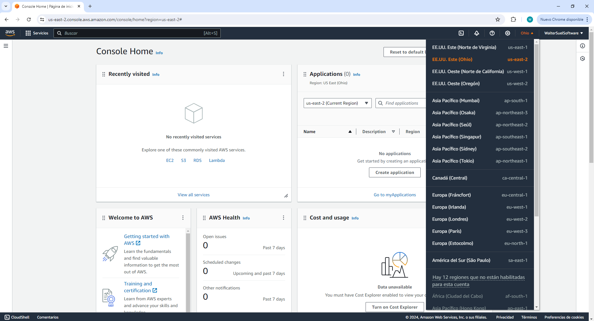

# 14. Seccion de servicios

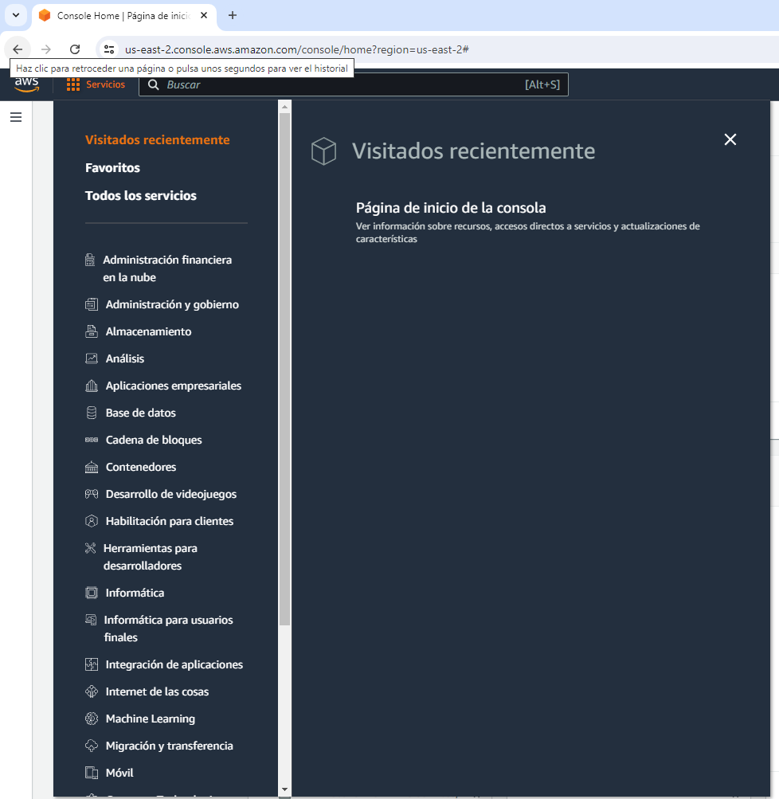

# 15. EC2

En la seccion de informatica encontramos al EC2

Amazon EC2 (Elastic Compute Cloud) es uno de los servicios centrales ofrecidos por Amazon Web Services (AWS). EC2 proporciona capacidad de computación escalable en la nube de Amazon. Esto significa que permite a los usuarios alquilar servidores virtuales (instancias) para ejecutar aplicaciones y gestionar cargas de trabajo.

**Usos Comunes de EC2**

- **Hosting de Sitios Web y Aplicaciones:** Muchas empresas utilizan EC2 para alojar sitios web y aplicaciones debido a su escalabilidad y flexibilidad.
- **Procesamiento de Datos:** Las instancias se pueden utilizar para tareas de procesamiento intensivo, como análisis de grandes volúmenes de datos.
- **Entornos de Desarrollo y Pruebas:** EC2 proporciona un entorno controlado para desarrollo y pruebas, facilitando la implementación y el escalado de aplicaciones en etapas de producción.
- **Recuperación ante Desastres:** Al tener infraestructura en la nube, EC2 se puede usar como parte de una solución de continuidad de negocio y recuperación ante desastres.

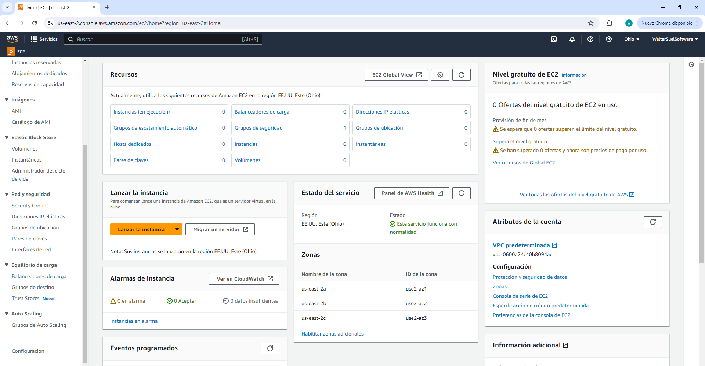

Damos click en lanzar instancia

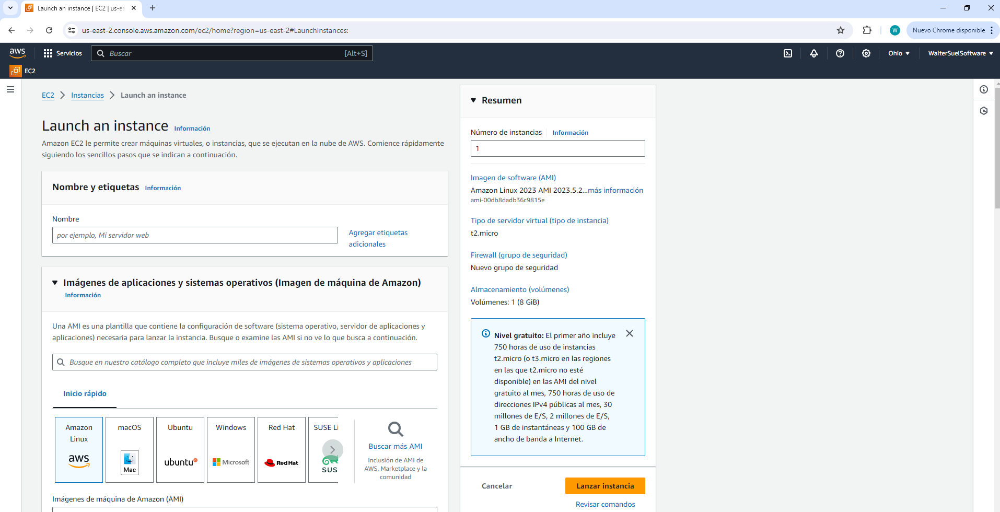

Dando click en buscar mas imagenes o sistemas operativos y filtrando solo el nivel gratuito:

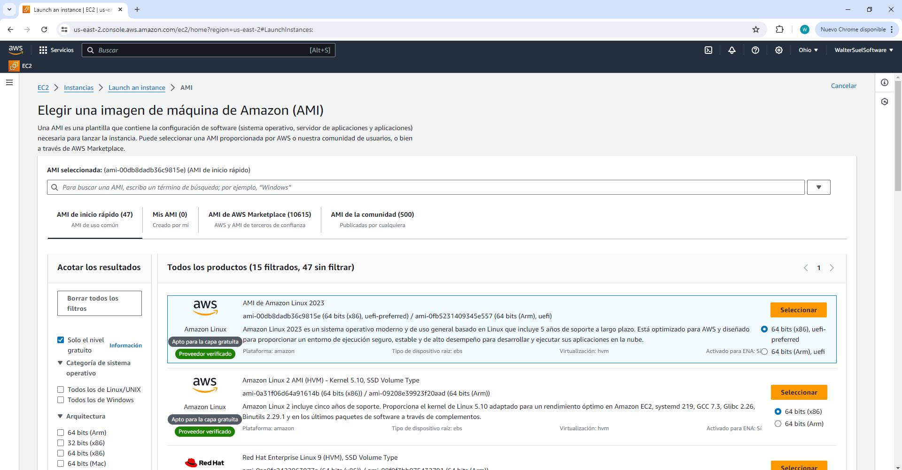

Elegimos para este ejemplo el de Ubuntu y verificamos que diga "apto para la capa gratuita"

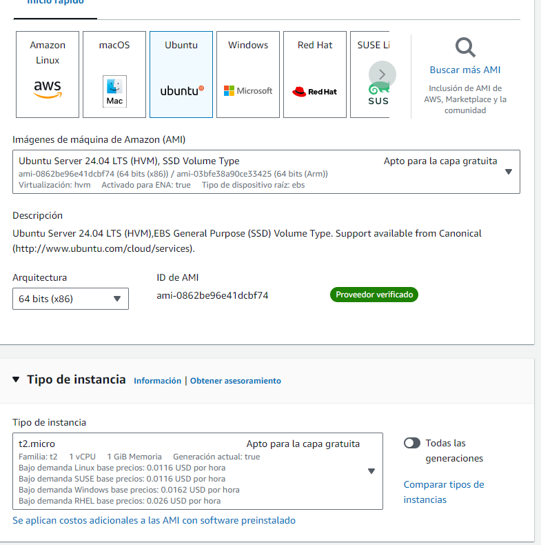

Realizamos algunas configuraciones de Red:

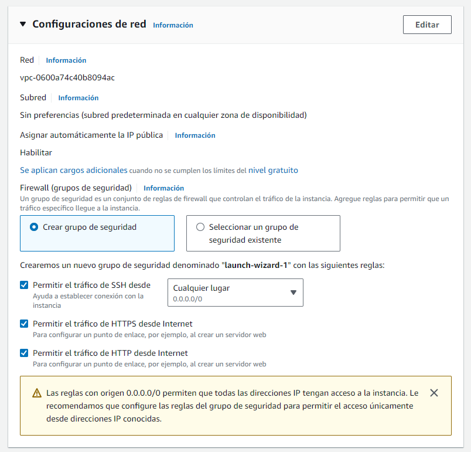

Luego configuramos el almacenamiento y "Lanzamos la instancia"

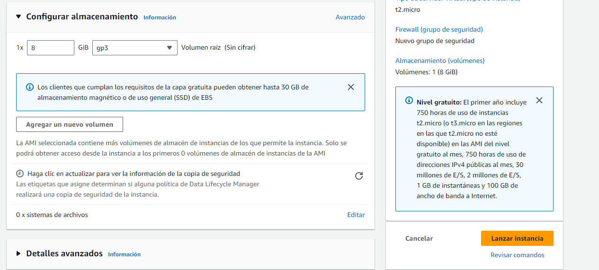

# 16. Dentro de nuestra instancia

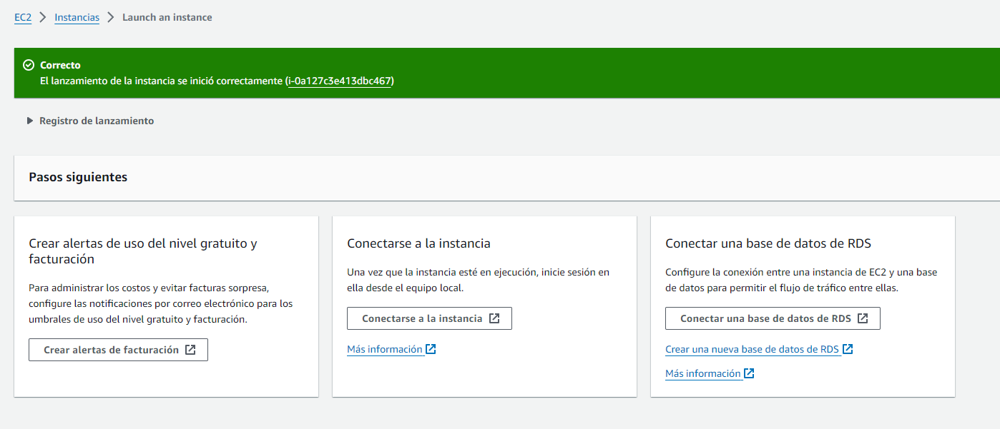

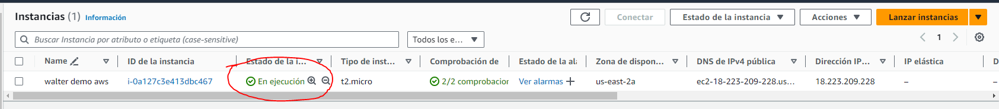

Vemos que ya esta en ejecucion la instancia

# 17. Conectar a la instancia

Le damos en "conectar"

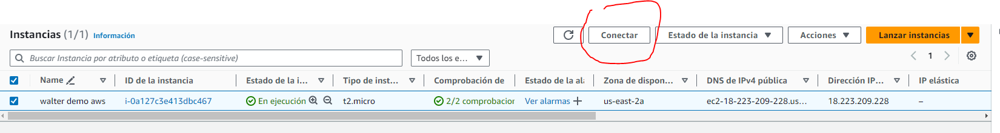

Para conectarnos hay varias formas, vamos a emplear la de Cliente SSH

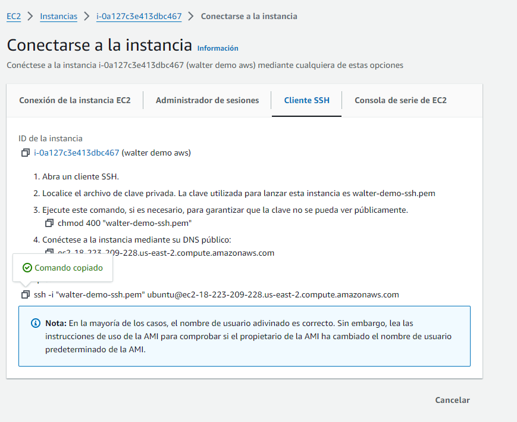

y usando el cmd o gitbash ponemos el comendo:

ssh -i "walter-demo-ssh.pem" ubuntu@ec2-18-223-209-228.us-east-2.compute.amazonaws.com

tal como se muestra a continuacion:

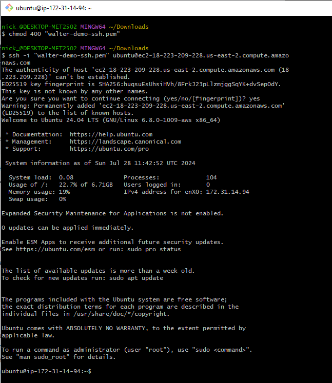

# 18. Arrancando nuestra maquina

Creamos algunos archivos de prueba y luego levantamos un servidor con:

sudo python3 -m http.server 80

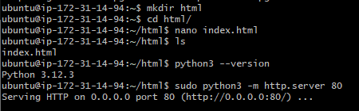

# 19. Instalando diferentes versiones de node.js dentro de la instancia

Ponemos el comando sudo apt-get install unzip

El comando sudo apt-get install unzip se utiliza en sistemas operativos basados en Linux que utilizan el gestor de paquetes apt (como Ubuntu y Debian) para instalar el programa unzip. 

El programa unzip se usa para extraer (descomprimir) los archivos y directorios contenidos dentro de un archivo .zip. Por ejemplo, si descargas un archivo llamado archivo.zip que contiene documentos o software, usarías unzip para abrirlo y extraer su contenido en tu sistema de archivos.

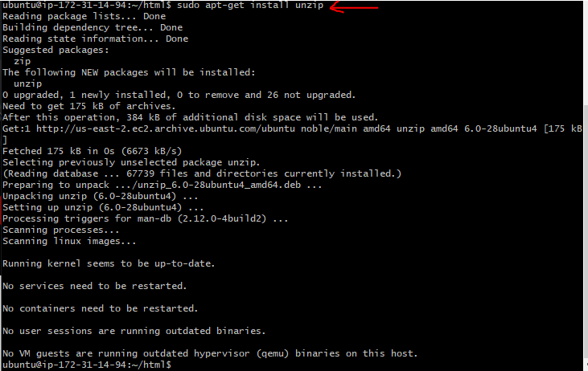

Ejecutamos el comando: curl -fsSL https://fnm.vercel.app/install | bash

El propósito de este comando es instalar fnm (Fast Node Manager), que es una herramienta para manejar múltiples versiones de Node.js. fnm permite a los usuarios cambiar fácilmente entre diferentes versiones de Node.js, instalar nuevas versiones, y más, de manera similar a otras herramientas como nvm pero con un enfoque en ser más rápido y sencillo.

https://github.com/Schniz/fnm

Luego nos vamos al path: 

source /home/ubuntu/.bashrc

Y luego : fnm install 20

El comando fnm install 20 que mencionaste es parte de fnm (Fast Node Manager), una herramienta de gestión de versiones de Node.js diseñada para ser rápida y sencilla. El comando específico está diseñado para instalar una versión particular de Node.js.

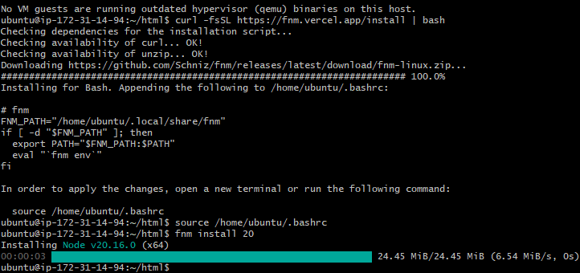

# 20. Mi recomendacion

Nunca dejar encendida una instancia de aws que no se va a utilizar, por lo que debemos eliminarlo

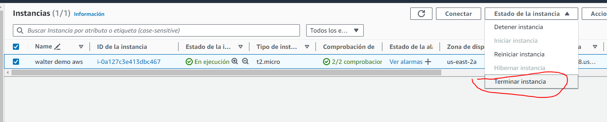

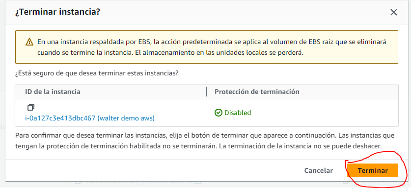

# 21. RDS (Relational Database service)

Amazon RDS (Relational Database Service) es un servicio gestionado en la nube proporcionado por AWS (Amazon Web Services) que facilita la configuración, operación y escalado de bases de datos relacionales en la nube. Ofrece una capacidad económica y redimensionable mientras maneja tareas de administración de bases de datos tediosas, permitiendo así que te concentres en tus aplicaciones y negocios.

**¿Para qué se usa Amazon RDS?**
Amazon RDS se utiliza para ejecutar bases de datos relacionales sin la necesidad de dedicar tiempo y recursos a la administración de hardware y al software de base de datos. Algunas de las tareas de administración que RDS automatiza incluyen:

- **Provisionamiento de Hardware:** Automáticamente configura la infraestructura de hardware necesaria para ejecutar tu instancia de base de datos.
- **Configuración de la Base de Datos:** Permite seleccionar el motor de base de datos y configurarla según las necesidades de tu aplicación.
- **Parches de Software:** Automáticamente aplica parches al software del motor de base de datos. Los parches de software son actualizaciones que los desarrolladores de software liberan para sus programas. Estas actualizaciones pueden contener correcciones de errores, mejoras en el rendimiento, actualizaciones de seguridad, y nuevas funcionalidades. En el contexto de las bases de datos, estos parches son cruciales porque pueden abordar vulnerabilidades de seguridad y otros problemas críticos que podrían afectar la estabilidad, el rendimiento, o la seguridad de la base de datos.
- **Backups y Snapshots:** Realiza backups de tu base de datos y permite restaurar a un punto en el tiempo o crear snapshots que puedes mantener para recuperación de desastres.
- **Escalabilidad:** Puedes escalar los recursos de computación y almacenamiento asociados con tus instancias de base de datos de manera fácil y rápida.
- **Alta Disponibilidad:** Ofrece opciones para implementar réplicas de bases de datos en diferentes zonas de disponibilidad para aumentar la durabilidad y la disponibilidad.

**Ejemplos de Uso de Amazon RDS**

**Aplicaciones Web y Móviles:** Amazon RDS puede ser utilizado para soportar la capa de datos de aplicaciones web y móviles, proporcionando una base de datos escalable y de alta disponibilidad. Por ejemplo, una aplicación de comercio electrónico podría utilizar RDS para almacenar información sobre productos, inventario, y transacciones de usuarios.

# 22. Documentdb

En los servicos que proporciona amazon tenemos varios relacionados a base de datos, una de ellas es Document DB

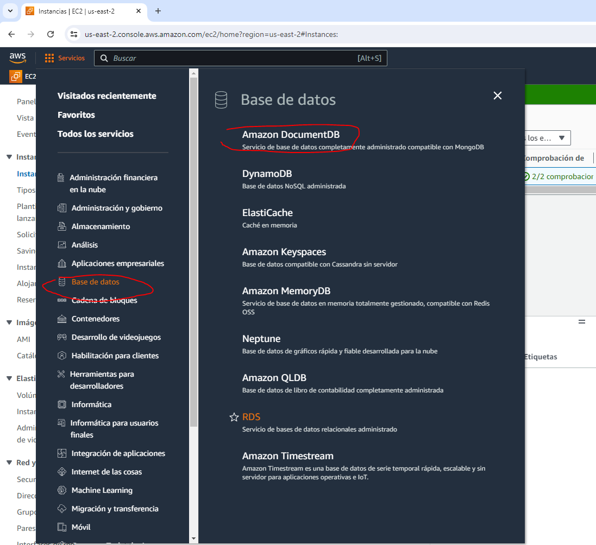

Amazon DocumentDB es un servicio de base de datos de documentos ofrecido por Amazon Web Services (AWS) que está diseñado para ser compatible con cargas de trabajo que utilizan MongoDB, un popular sistema de gestión de bases de datos de documentos NoSQL. DocumentDB está diseñado para ofrecer una escalabilidad, durabilidad y seguridad mejoradas mientras maneja grandes cantidades de datos.

**¿Qué es una Base de Datos de Documentos?**

Una base de datos de documentos almacena datos en formato de documento, generalmente en JSON (JavaScript Object Notation), que permite una estructura de datos más flexible comparada con las bases de datos relacionales tradicionales. Los documentos pueden contener muchos tipos de datos anidados y no necesitan seguir un esquema rígido. Esto hace que las bases de datos de documentos sean ideales para aplicaciones que requieren gran flexibilidad y velocidad para manejar datos con estructuras variadas.

# 23. Dynamo DB

Amazon DynamoDB es un servicio de base de datos NoSQL ofrecido por Amazon Web Services (AWS) que proporciona rendimiento a velocidad de rayo con escalabilidad y fiabilidad sin igual. Está diseñado para garantizar una latencia de milisegundos de un solo dígito en cualquier escala y manejar más de 10 billones de solicitudes por día. Es una base de datos completamente gestionada, lo que significa que AWS se encarga de tareas como el mantenimiento del servidor, las actualizaciones de software, y el escalamiento.

**Características Clave de DynamoDB**

**1. Rendimiento y Escalabilidad:**

DynamoDB puede escalar automáticamente para ajustarse a las cargas de trabajo, utilizando su característica de escalamiento automático para ajustar la capacidad de acuerdo a las necesidades del tráfico en tiempo real. Esto asegura que la base de datos puede manejar picos de tráfico repentinos sin degradación del rendimiento.

**2. Modelo de Datos NoSQL:**

Como una base de datos NoSQL, DynamoDB utiliza un modelo de datos clave-valor y documentos. Esto permite una flexibilidad significativa en términos de los datos que puede almacenar y cómo se pueden recuperar.

**3. Alta Disponibilidad y Durabilidad:**

DynamoDB está diseñado para replicar datos automáticamente a través de tres zonas de disponibilidad en una región de AWS, proporcionando alta disponibilidad y protección de datos contra la pérdida de un servidor o incluso de todo un centro de datos.

**4. Latencia Baja:**

Ofrece tiempos de respuesta de milisegundos de un solo dígito, lo que la hace ideal para aplicaciones de respuesta rápida como juegos móviles, tecnologías publicitarias, o sistemas financieros.

**5. Seguridad:**

Integra controles de seguridad que permiten encriptación en reposo y en tránsito, gestión de acceso fino a través de AWS IAM (Identity and Access Management), y otras medidas de seguridad para proteger y controlar el acceso a los datos.

**6. Backup y Restauración:**

DynamoDB proporciona capacidades de backup y restauración. Los backups son consistentes en el punto en el tiempo y no impactan el rendimiento de las aplicaciones cliente.

**7. Integraciones de AWS:**

Se integra bien con otros servicios de AWS, como Amazon Lambda, para realizar procesamiento de datos en tiempo real, y Amazon S3 para análisis de grandes volúmenes de datos con Amazon Redshift.

# 24. Amazon MemoryDB

Amazon MemoryDB for Redis es un servicio de base de datos en memoria totalmente gestionado ofrecido por AWS que es compatible con Redis, un popular almacén de datos en memoria de código abierto. MemoryDB se diseñó para ofrecer un rendimiento extremadamente rápido, almacenamiento de datos duradero y altamente disponible, facilitando el uso de Redis sin las complicaciones de administrar la infraestructura subyacente.

**Usos Comunes de Amazon MemoryDB**

**Caché de Aplicaciones:** MemoryDB es comúnmente utilizado como una caché para reducir la carga en bases de datos tradicionales, almacenando resultados de consultas frecuentes o datos de sesión de usuario.

**Almacenamiento de Estado de Sesión:** Ideal para aplicaciones web y móviles donde el estado del usuario necesita ser almacenado y recuperado rápidamente a lo largo de múltiples sesiones.

**Colas de Mensajes:** Se puede utilizar para implementar colas de mensajes en memoria para asegurar el procesamiento rápido de tareas en aplicaciones distribuidas.

**Tablas de Líderes y Contadores en Tiempo Real:** Utilizado en juegos online y aplicaciones sociales para mantener tablas de líderes en tiempo real y otros contadores dinámicos.

# 25. RDS

Entrando en RDS y dando click en "Crear base de datos" veremos una serie de opciones de motores de base de datos

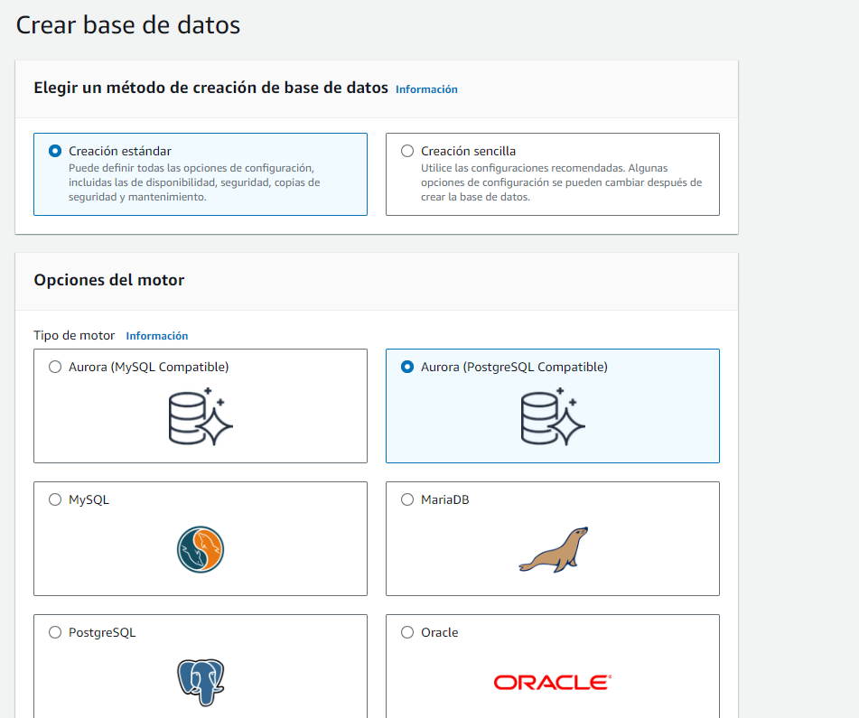

Tenemos dos opciones relacionadas con la configuración de Amazon RDS (Relational Database Service), específicamente para mejorar la disponibilidad y el rendimiento de las bases de datos en AWS.

1. Mostrar las versiones compatibles con el clúster de base de datos multi-AZ

Esta opción permite crear un clúster de base de datos en configuración Multi-AZ, que significa Múltiples Zonas de Disponibilidad. Un clúster Multi-AZ consta de una instancia de base de datos principal y dos instancias de base de datos en espera que se sitúan en zonas de disponibilidad diferentes.

**Beneficios:**

- Alta disponibilidad: Al tener réplicas en diferentes zonas de disponibilidad, se asegura que la base de datos pueda continuar operando sin interrupciones en caso de que una zona experimente fallos.
- Conmutación por error automática: Si la instancia principal falla, Amazon RDS automáticamente conmutará a una de las instancias de réplica en menos de 35 segundos, garantizando así mínima interrupción del servicio.
- Mejor rendimiento de lectura: Al tener múltiples réplicas, se puede dirigir el tráfico de lectura hacia las instancias secundarias, lo que reduce la carga en la instancia principal y mejora el rendimiento de la base de datos.

2. Mostrar versiones compatibles con las escrituras optimizadas de Amazon RDS

Esta opción refiere a una característica de optimización de escrituras que mejora el rendimiento de las operaciones de escritura en la base de datos.

**Beneficios:**

- Mejora del rendimiento de escritura: Según la descripción, esta característica puede mejorar el rendimiento de las operaciones de escritura hasta dos veces sin ningún costo adicional.
- Costo-eficiencia: Al mejorar el rendimiento sin costos adicionales, se maximiza la eficiencia del sistema mientras se controlan los gastos operativos.

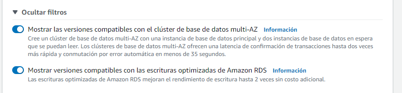

En las plantillas elejimos la capa gratuita, lueg le ponemos un nombre a nuestra instancia de basde de datos, le ponemos un nombre de usuario maestro y le creamos una contraseña maestra.

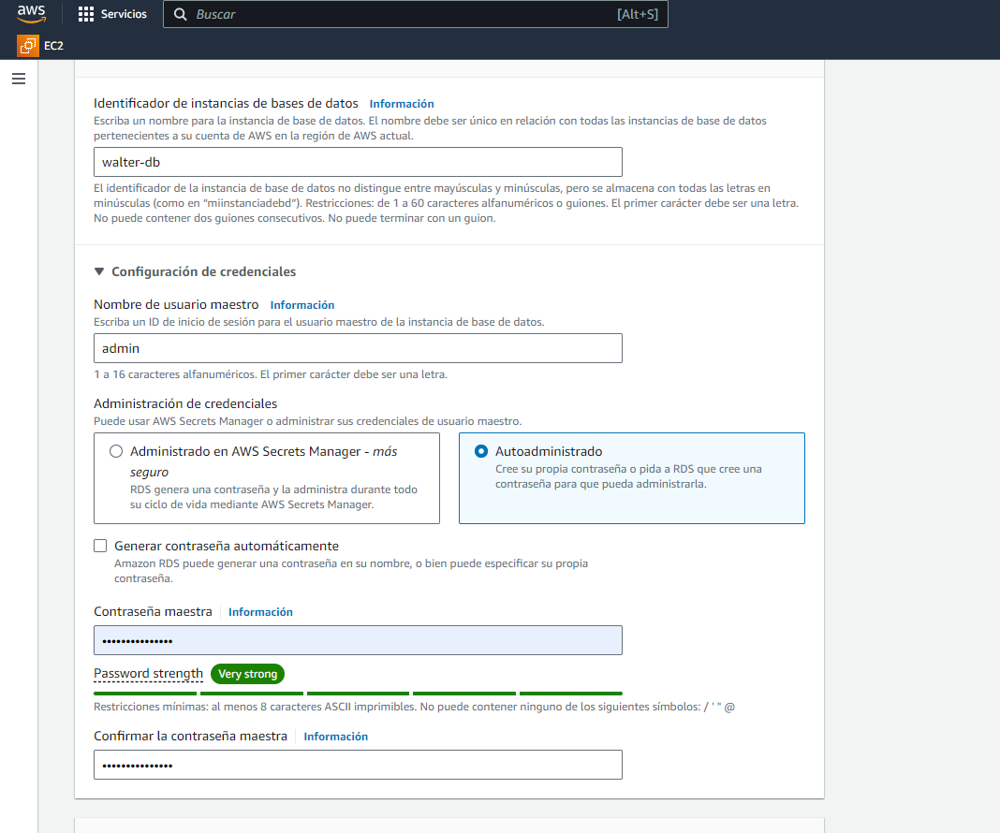

# 26. Conectividad

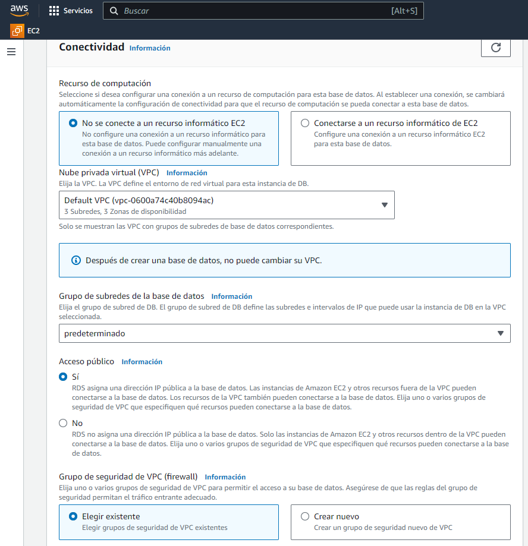

# 27. Costos

A pesar de que estamos en la capa gratuita AWS nos cobra un monto minimo, que luego para que no nos cobre debemos desactivarlo

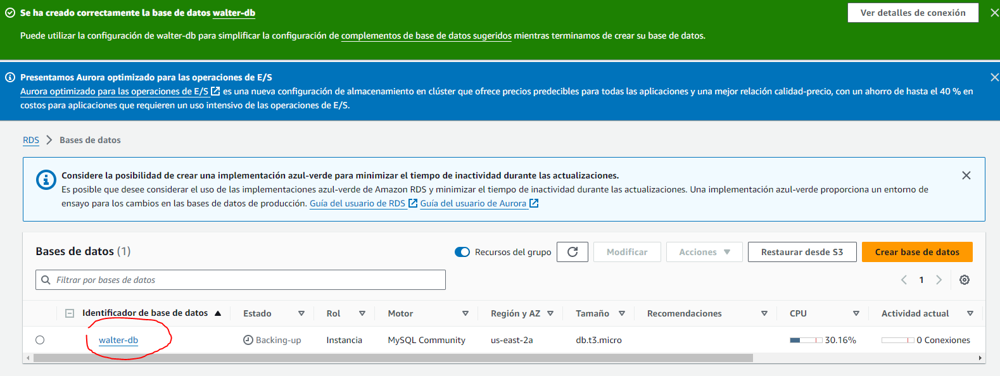

# 28. Planet Scale

PlanetScale es una plataforma de base de datos compatible con MySQL diseñada para proporcionar escalabilidad, rendimiento y confiabilidad sin comprometer la experiencia del desarrollador. Utiliza Vitess, una tecnología de base de datos de código abierto inicialmente desarrollada en YouTube para manejar grandes volúmenes de datos y usuarios. Esto permite a PlanetScale ofrecer características como el sharding horizontal y cambios de esquema no bloqueantes, lo cual es ideal para empresas que necesitan manejar grandes bases de datos sin sufrir tiempos de inactividad durante las actualizaciones o mantenimientos.

https://planetscale.com/

# 29. S3

Amazon S3 (Simple Storage Service) es un servicio de almacenamiento en la nube ofrecido por Amazon Web Services (AWS). Proporciona un almacenamiento de objetos escalable, de alta disponibilidad y bajo costo, diseñado para almacenar y recuperar cualquier cantidad de datos desde cualquier lugar de Internet. Es ampliamente utilizado para una variedad de aplicaciones, desde sitios web y aplicaciones móviles hasta aplicaciones empresariales y de big data.

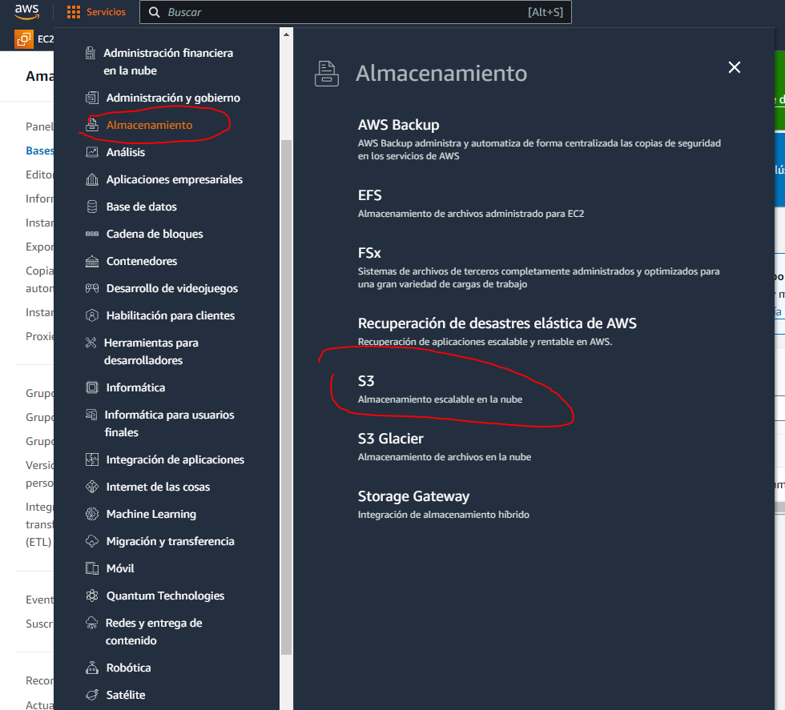

**Características Principales de Amazon S3**

- Almacenamiento de Objetos: S3 almacena datos como objetos dentro de contenedores llamados "buckets". Cada objeto se identifica de forma única dentro de un bucket mediante una clave asignada por el usuario.

- Durabilidad y Disponibilidad: Amazon S3 ofrece una durabilidad del 99.999999999% (11 nueves), lo que garantiza que los datos están seguros y protegidos. Además, ofrece varias opciones de almacenamiento que varían en términos de costo, disponibilidad y frecuencia de acceso.

- Seguridad: S3 proporciona controles avanzados de seguridad, como políticas de bucket y Control de Acceso basado en Roles (IAM) para gestionar quién puede acceder a los datos. También soporta el cifrado de datos en reposo y en tránsito.

- Escalabilidad: Puedes almacenar y recuperar cualquier cantidad de datos en cualquier momento. S3 se escala automáticamente para manejar picos en la carga de trabajo sin necesidad de intervención manual.

- Gestión de Datos: Ofrece características como el versionado, para mantener múltiples versiones del mismo objeto; ciclo de vida de los datos, para automatizar el archivado o eliminación de objetos; y transferencia de datos optimizada, utilizando diversas herramientas de transferencia de AWS.

- Integración: Se integra con otros servicios de AWS, como Amazon Glacier para el archivado a largo plazo, AWS Lambda para ejecutar código en respuesta a eventos de S3, y Amazon EMR (Elastic MapReduce) para el procesamiento de big data.

**Usos Comunes de Amazon S3**

- Backup y Recuperación: Ideal para realizar backups de datos críticos y recuperarlos cuando sea necesario.

- Alojamiento de Sitios Web Estáticos: Puedes utilizar S3 para almacenar y servir sitios web estáticos, que contienen HTML, CSS y archivos JavaScript.

- Almacenamiento de Medios: Utilizado por aplicaciones de streaming para almacenar y distribuir contenido multimedia, como videos, música y imágenes.

- Archivado de Datos: Para empresas que necesitan archivar datos históricos de forma segura y económica.

- Big Data y Análisis: Utilizado como repositorio de datos para grandes volúmenes de datos analíticos que requieren procesamiento por servicios como AWS Athena o Amazon Redshift.

# 30. Creando un bucket

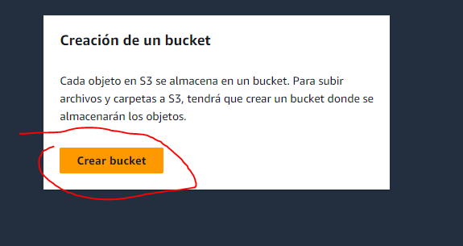

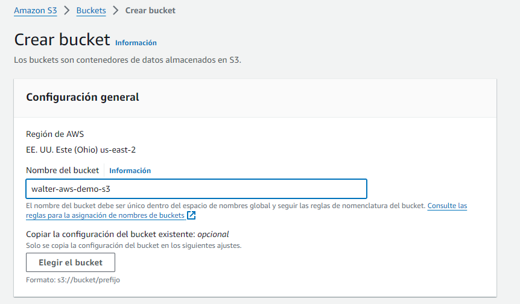

# 31. Propiedad de objetos

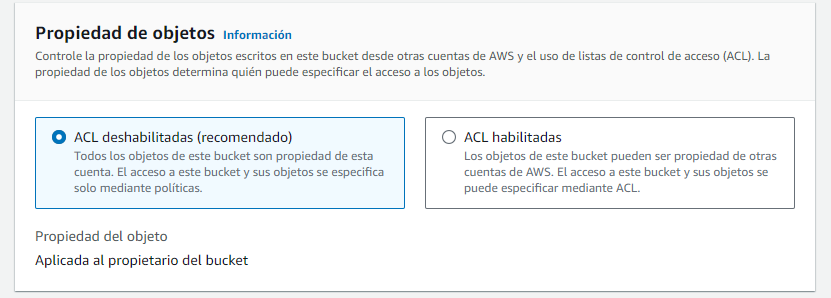

# 32. Configuracion de bloqueo de acceso publico

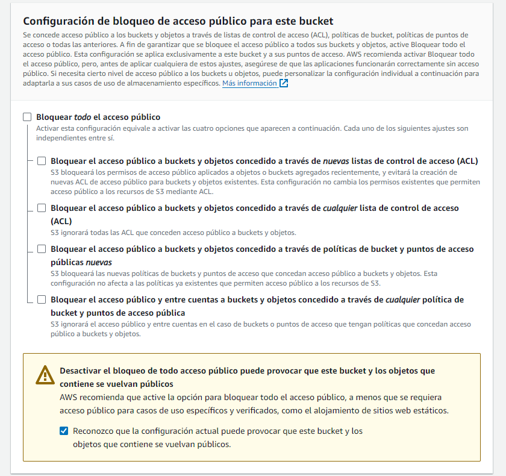

# 33. Control de versiones de buckets, etiquetas

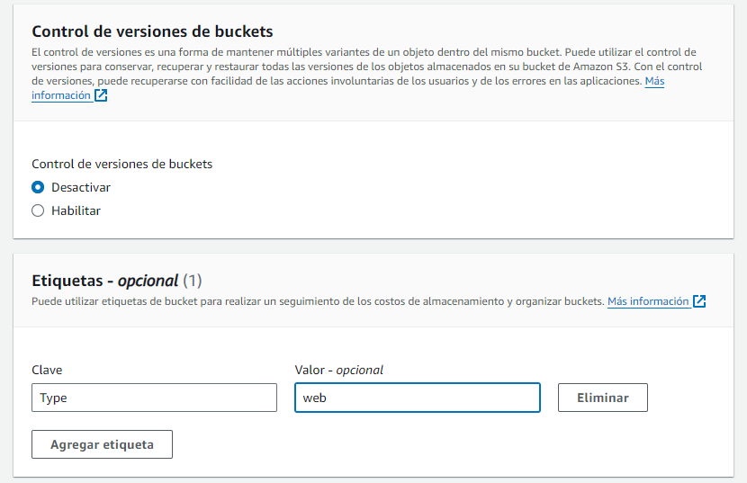

# 34. Cifrado predeterminado

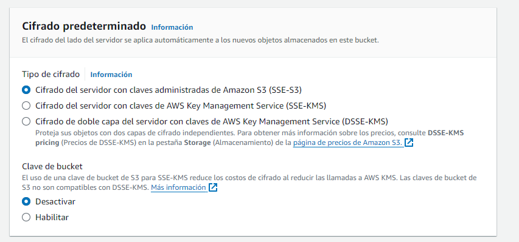

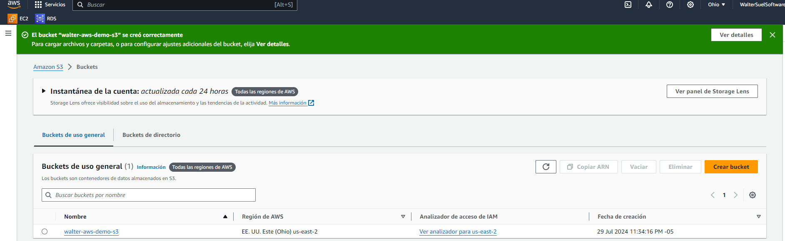

# 35. Creando una carpeta

# 36. Cargando una imagen

# 37. Clase de almacenamiento

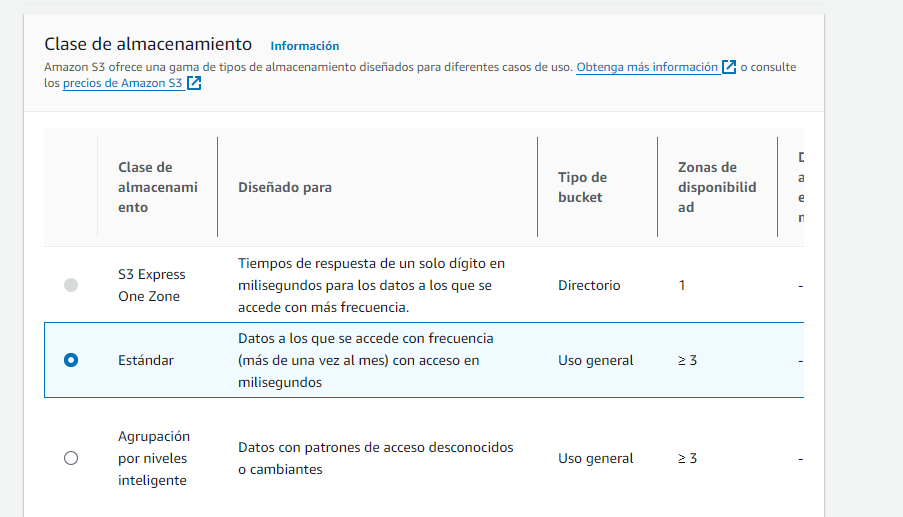

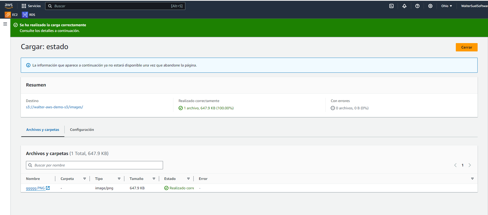

# 38. Error tipico en S3

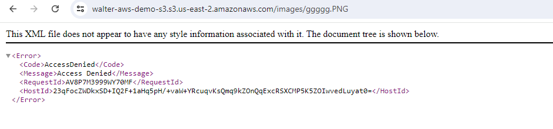

# 39. Politica de bucket

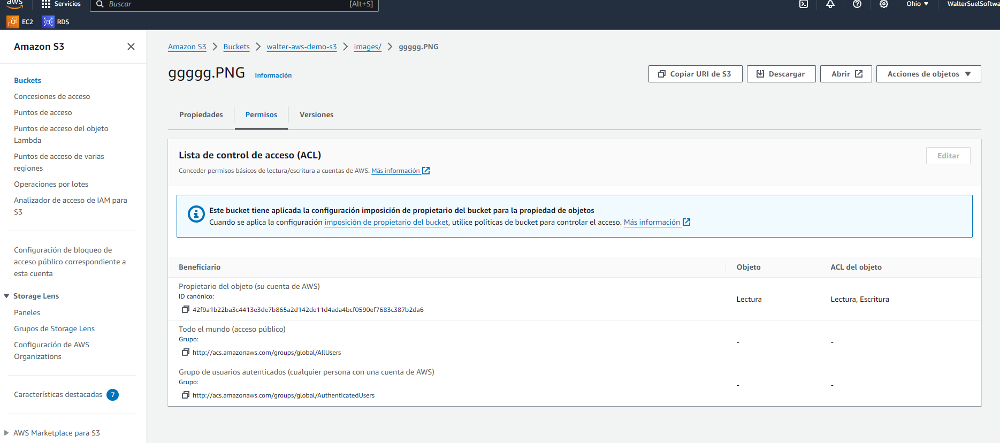

Tenemos el acceso publico pero debemos tener una politica.
Nos vamos a ver algunos ejemplos de politicas:
 
 https://docs.aws.amazon.com/AmazonS3/latest/userguide/example-bucket-policies.html?icmpid=docs_amazons3_console

 Adaptamos ese ejemplo segun nuertros requerimientos y eso ira como politica, luego guardamos los cambios:

 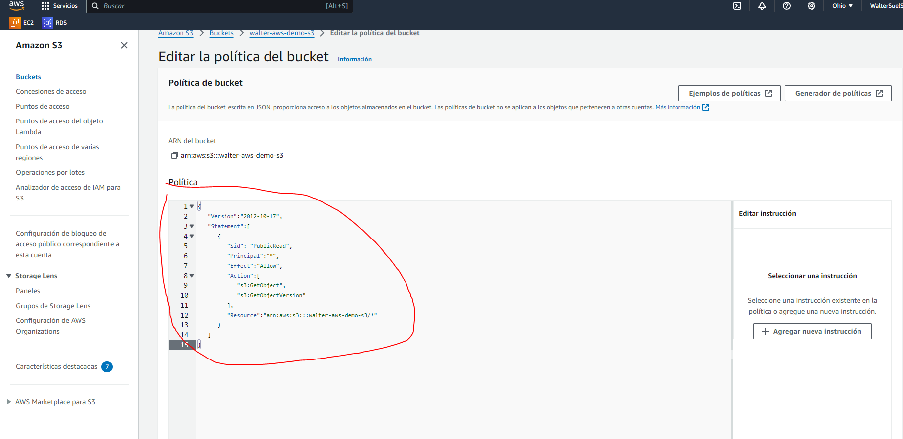

 Con eso ya podriamos visualizar la imagen que hemos cargado

# 40. Desplegar una pagina web entera
# 41. Configurar las llaves
# 42. Creando un usuario

Nos vamos al servicio de AWS "iam" y luego nos vamos a usuarios y creamos un usuario:

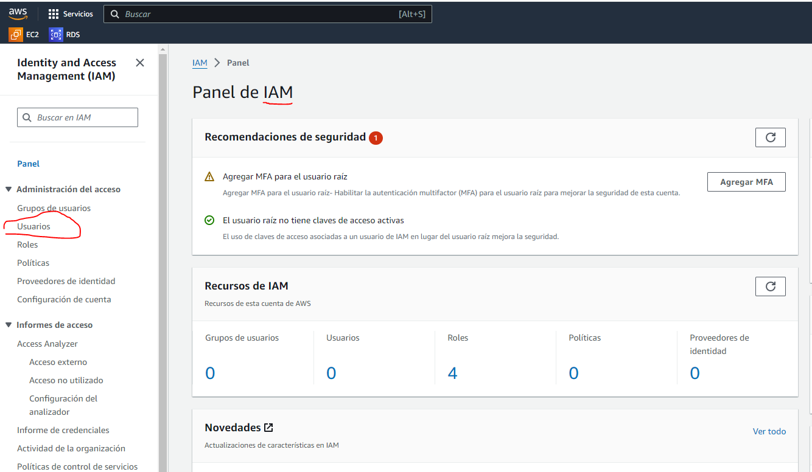

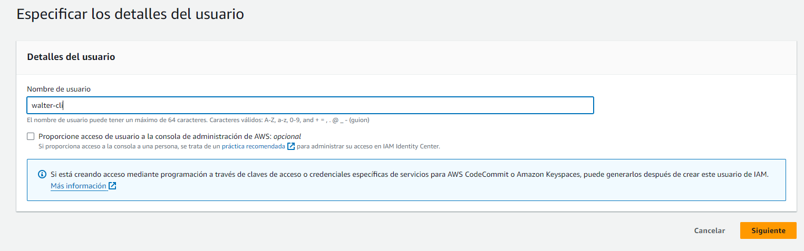

Establecemos permisos y creamos el usuario

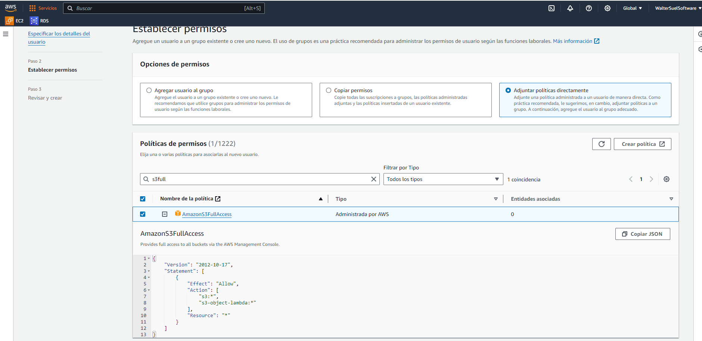

# 43. Clave de acceso

Entramos al usuario creado y creamos una clave de acceso:

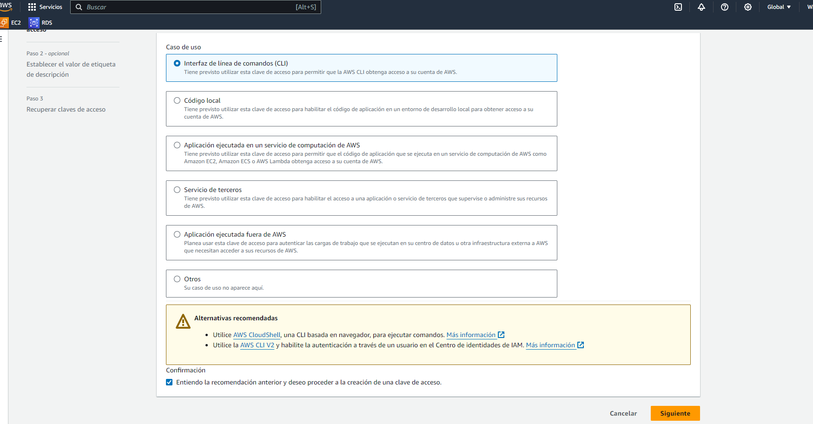

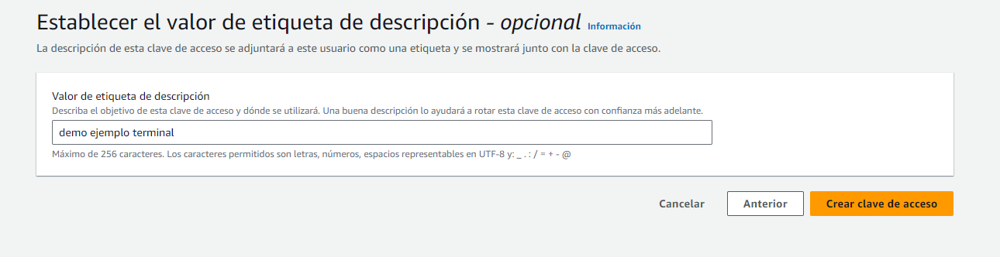

# 44. Configurando claves

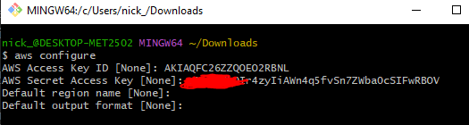

# 45. Deploy para la web
# 46. Mejorando el rendimiento

Subimos los archivos al buckets con: aws s3 sync ./dist s3://(nombre del recurso de amazon)

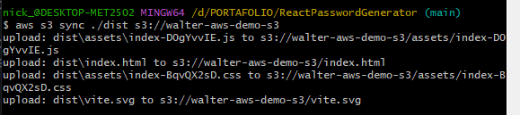

Verificamos que se ha cargado el proyecto correctamente

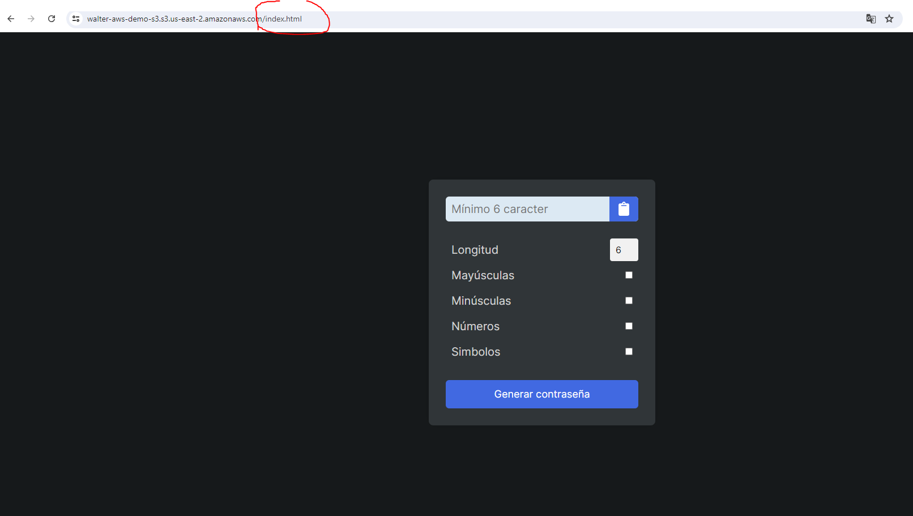

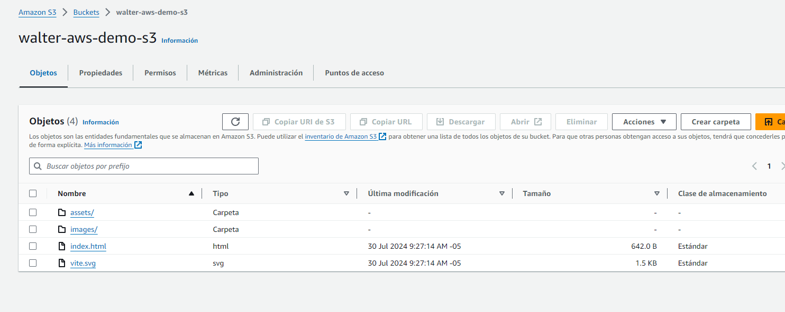

En propiedades-> Alojamiento de sitios web estaticos configuramos para poder alojar nuestros sitios web: 

https://us-east-2.console.aws.amazon.com/s3/buckets/walter-aws-demo-s3?region=us-east-2&bucketType=general&tab=properties

# 47. Reglas de redireccionamiento (SPA)

No es necesario configurar reglas de redireccionamiento.

Al configurar lo basico y guardar los cambios ya tenemos alojada el sitio web: 

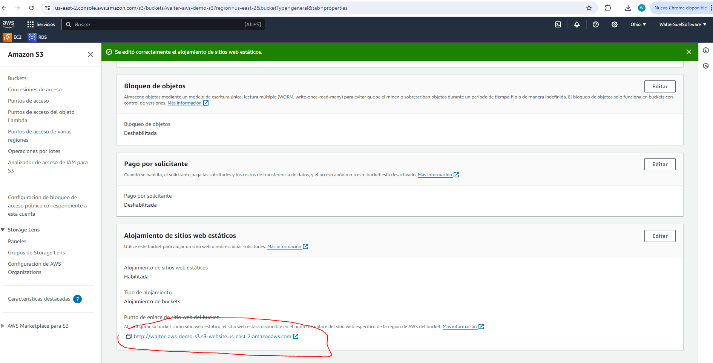

# 48. ¿Y si hacemos cambios en nuestro proyecto?

Dentro de nuestro proyecto configuramos el deploy y modificamos algun archivo para ver los cambios: 

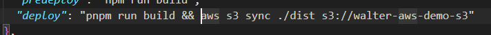

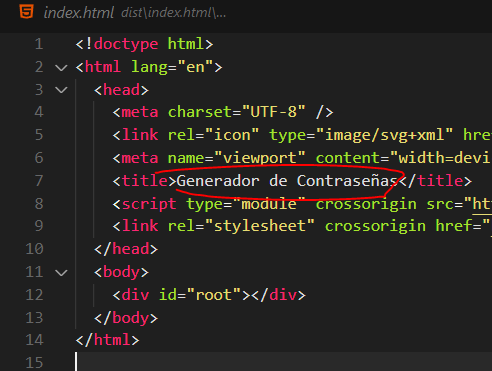

# 49. Lambda

Amazon Lambda, más conocido como AWS Lambda, es un servicio de computación sin servidor ofrecido por Amazon Web Services (AWS) que permite ejecutar código en respuesta a eventos sin necesidad de gestionar servidores. AWS Lambda maneja automáticamente la administración de la infraestructura, incluida la capacidad de cómputo, el mantenimiento de servidores, el balanceo de carga, y el escalado automático.

**Características Principales de AWS Lambda**

- Basado en Eventos: AWS Lambda se activa automáticamente en respuesta a eventos provenientes de otros servicios de AWS o aplicaciones directas. Esto incluye eventos como cambios en archivos en S3, actualizaciones en tablas de DynamoDB, solicitudes HTTP a través de Amazon API Gateway, entre otros.

- Gestión Automática de la Infraestructura: Lambda gestiona todos los aspectos de la infraestructura de cómputo, permitiendo que te enfoques en escribir código en lugar de administrar servidores. Esto incluye el mantenimiento de la máquina, configuración del sistema operativo, parches de seguridad, escalado y más.

- Facturación por Uso: Solo pagas por el tiempo de cómputo que consumes, medido en milisegundos y por la cantidad de veces que tu función es invocada. Esto hace que Lambda sea un servicio económico para muchos escenarios de uso.

- Lenguajes de Programación Soportados: AWS Lambda soporta múltiples lenguajes de programación, incluyendo Node.js, Python, Ruby, Java, Go, .NET Core y PowerShell.

- Integraciones: Se integra de forma nativa con otros servicios de AWS para crear aplicaciones poderosas y escalables que reaccionan rápidamente a nuevos datos o eventos.

**Usos Comunes de AWS Lambda**

- Procesamiento de Datos: Puede ser usado para realizar transformaciones de datos en tiempo real, como filtrar, clasificar y otros procesamientos de datos provenientes de servicios como Amazon S3 o DynamoDB.

- Backends de Aplicaciones Web y Móviles: Lambda puede servir como un backend escalable para aplicaciones web y móviles al responder a solicitudes HTTP a través de Amazon API Gateway.

- Automatización de Tareas: Automatizar tareas administrativas y de mantenimiento, como realizar backups automáticos, monitorizar recursos y responder a alertas de estado.

- IoT (Internet de las Cosas): Puede procesar y gestionar rápidamente las solicitudes y los datos generados por dispositivos IoT conectados a AWS IoT Core.

# 50. Creando una Lambda

Damos clic en crear una funcion:

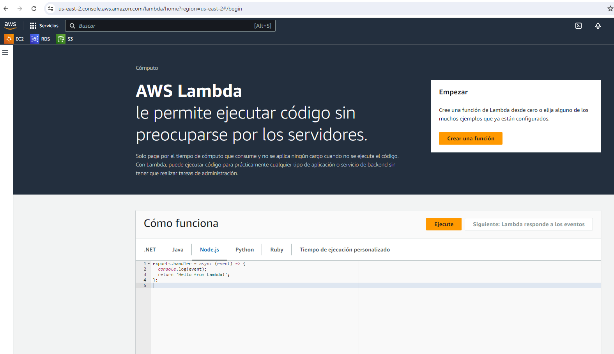


Le damos en test


Le damos en test nuevamente


# 51. Testeando
# 52. Código


Luego de realizar el deploy y volver a ejecutar el test obtenemos la respuesta


# 53. Monitorizacion

La sección de monitorización en AWS Lambda sirve para observar y analizar el rendimiento y la actividad de tus funciones Lambda. Aquí se resumen algunas de las principales funcionalidades que proporciona esta sección:

1. Visualización de métricas: Puedes ver métricas clave como el número de invocaciones, la duración de las ejecuciones, los errores, la concurrencia y las iteraciones en frío. Estas métricas son útiles para entender cómo se están desempeñando tus funciones y para identificar problemas o cuellos de botella.

2. Alarmas: Puedes configurar alarmas basadas en métricas específicas. Por ejemplo, podrías establecer una alarma para recibir notificaciones cuando el número de errores sobrepase un umbral determinado. Esto es esencial para la gestión proactiva y la respuesta rápida a posibles problemas.

3. Registros: En esta sección también puedes acceder a los registros generados por tus funciones Lambda. AWS Lambda automáticamente integra con Amazon CloudWatch Logs, donde cada invocación de tu función genera un stream de registros. Esto es crucial para depurar y rastrear el comportamiento de tus funciones.

4. Rastreo: Con la integración de AWS X-Ray, puedes habilitar el rastreo para analizar y depurar las arquitecturas de microservicios. Esto te permite ver cómo las peticiones atraviesan tus funciones y otros servicios AWS, ayudándote a identificar ineficiencias y puntos de fallo.

La monitorización es una herramienta clave para asegurar que las funciones Lambda operan eficientemente y sin errores, permitiendo optimizar el rendimiento y la escalabilidad de tus aplicaciones.


# 54. Desencadenadores


# 55. Usar como url


# 56. Conectandose a la base de datos


# 57. Eliminando base de datos


# 58. ¿Cuanto dinero debo pagar?
# 59. Certificacion de AWS